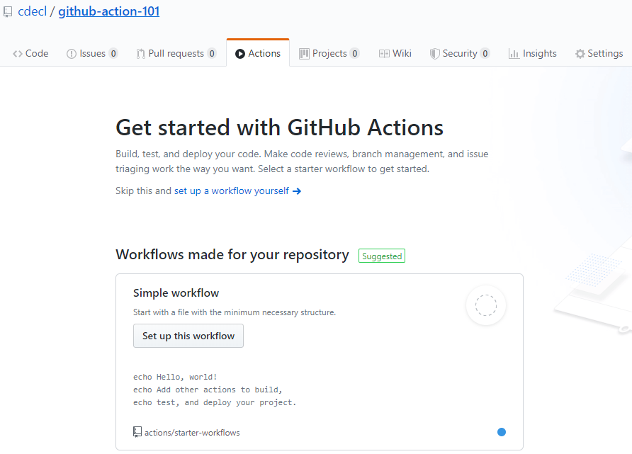
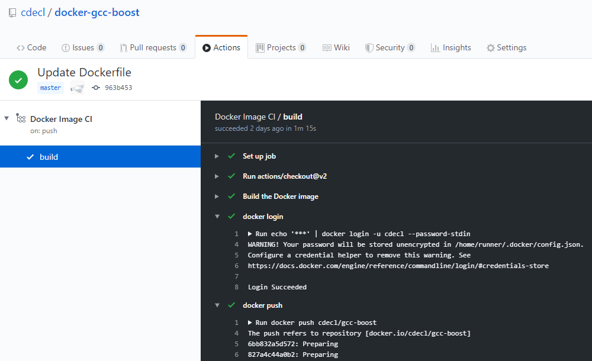
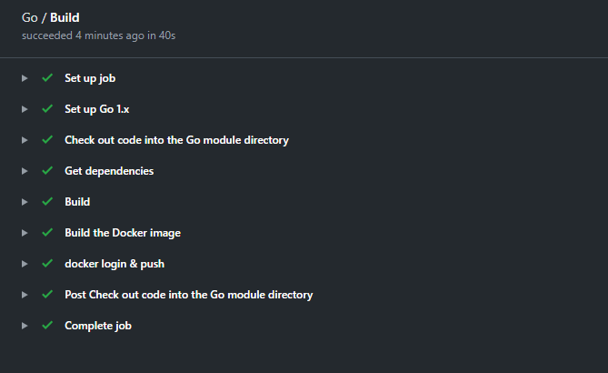

# github-action-101
Gihub Action 활용을 위한 기본 내용 

## Contents
- [Github Actions](#github-actions)
	- [Runner 종류](#runner-%EC%A2%85%EB%A5%98)
	- [WorkFlow 기본 Template](#workflow-%EA%B8%B0%EB%B3%B8-template)
	- [Actions 예제](#actions-%EC%98%88%EC%A0%9C)
		- [Docker Build & Registry Push](#docker-build--registry-push)
		- [MSBuild & Nuget](#msbuild--nuget)
		- [Container Image 활용](#container-image-%ED%99%9C%EC%9A%A9)
		- [Go build 및 Docker image registry](#go-build-%EB%B0%8F-docker-image-registry)

## Github Actions
- Github 에서 제공하는 Workflow 툴 
- GitHub-hosted Runner or Self-Hosted Runner 에서 실행 
- Actions 탭을 통해서 Template을 선택하고 Yaml 파일로 Task 내용을 기술
	- .github/workflows 디렉토리 밑에 위치 

### Runner 종류 
- GitHub-hosted Runner : MS Azure 가상머신에서 실행 
	- Public Repository : 무료
	- Private Repository : 2000분/월 무료 
- Self-Hosted Runner : 자체 머신을 통해 Runner Hosting 
	- https://help.github.com/en/actions/hosting-your-own-runners/adding-self-hosted-runners


### WorkFlow 기본 Template
- Actions Tab


 
- WorkFlow 기본 Template
	- name: workflow 이름 
	- on: Triggers Event 
	- jobs : Jobs
	- build: Single job name
	- runs-on: 가상환경 인스턴스
		- Ubuntu: macOS, Windows Server 제공 
		- Package or Apps가 기본 세팅된 상태 
			- https://github.com/actions/virtual-environments
		- Ubuntu : https://github.com/actions/virtual-environments/blob/master/images/linux/Ubuntu1804-README.md
		- Windows Server : https://github.com/actions/virtual-environments/blob/master/images/win/Windows2019-Readme.md
	- steps : Task Step
		- uses: 예약된 Actions 실행이나 Apps 통합을 통해 Apps 사용 환경 구성 
			- ex> uses: actions/checkout@v2 : git checkout 을 실행 
			- ex> uses: nuget/setup-nuget@v1 : nuget apps setup 
			- ex> uses: microsoft/setup-msbuild@v1 : msbuild setup
		- name, run: run 명령 이름 지정 및 run command 지정 
- 참고 : awesome-actions https://github.com/sdras/awesome-actions		


```yaml
name: CI

on:
  push:
    branches: [ master ]
  pull_request:
    branches: [ master ]

jobs:
  # This workflow contains a single job called "build"
  build:
    # The type of runner that the job will run on
    runs-on: ubuntu-latest

    steps:
    - uses: actions/checkout@v2

    - name: Run a one-line script
      run: echo Hello, world!

    - name: Run a multi-line script
      run: |
        echo Add other actions to build,
        echo test, and deploy your project.
```

### Actions 예제

#### Docker Build & Registry Push
- ubuntu-latest 이미지에는 Docker Daemon 활성화됨
- secrets 변수 : [Settings] - [Secrets] 에서 변수 세팅 (DOCKERHUB_PASS)
	- ${{ secrets.DOCKERHUB_PASS }}

```yaml
name: Docker Image CI

on:
  push:
    branches: [ master ]

jobs:
  build:
    runs-on: ubuntu-latest

    steps:
    - uses: actions/checkout@v2

    - name: Build the Docker image
      run: docker build . --tag cdecl/gcc-boost
    - name: docker login
      run: echo '${{ secrets.DOCKERHUB_PASS }}' | docker login -u cdecl --password-stdin
    - name: docker push
      run: docker push cdecl/gcc-boost
```



#### MSBuild & Nuget 
- Windows 서버 이미지 MSBuild 기반 빌드 
- msbuild 및 nuget setup 
	- uses: nuget/setup-nuget@v1
    - uses: microsoft/setup-msbuild@v1
- name 단위의 run task시 current direcotry reset 	

```yaml
name: C/C++ CI

on:
  push:
    branches: [ master ]

jobs:
  build:
    runs-on: windows-2019
    
    steps:
    - uses: actions/checkout@v2
    - uses: nuget/setup-nuget@v1
    - uses: microsoft/setup-msbuild@v1
      
    - name: nuget restore 
      run: | 
        cd src 
        nuget restore asb.sln
        
    - name: build
      run: |
        cd src 
        msbuild asb.vcxproj /p:configuration=release /p:platform=x64
```


#### Container Image 활용 
- docker container (cdecl/gcc-boost)를 활용 Task 실행 
	- container: cdecl/gcc-boost

```yaml
name: C/C++ CI

on:
  push:
    branches: [ master ]

jobs:
  build:
    runs-on: ubuntu-latest
    container: cdecl/gcc-boost

    steps:
    - uses: actions/checkout@v2
    
    - name: check 
      run: | 
        g++ --version
            
    - name: make 
      run: |
        cd src 
        make
```


#### Go build 및 Docker image registry 

```yaml
name: Go

on:
  push:
    branches: [ master ]

jobs:
  build:
    name: Build
    runs-on: ubuntu-latest
    steps:

    - name: Set up Go 1.x
      uses: actions/setup-go@v2
      with:
        go-version: ^1.13
      id: go

    - name: Check out code into the Go module directory
      uses: actions/checkout@v2

    - name: Get dependencies
      run: |
        go get -v -t -d ./...

    - name: Build
      run: go build -v .

    - name: Build the Docker image
      run: docker build . --tag cdecl/go-sitecheck

    - name: docker login & push
      run: | 
        echo '${{ secrets.DOCKERHUB_PASS }}' | docker login -u cdecl --password-stdin
		docker push cdecl/go-sitecheck
```

